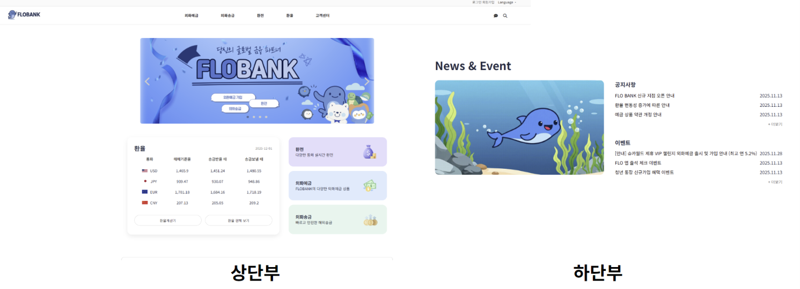
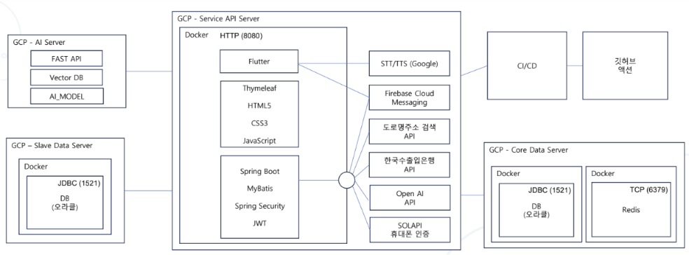
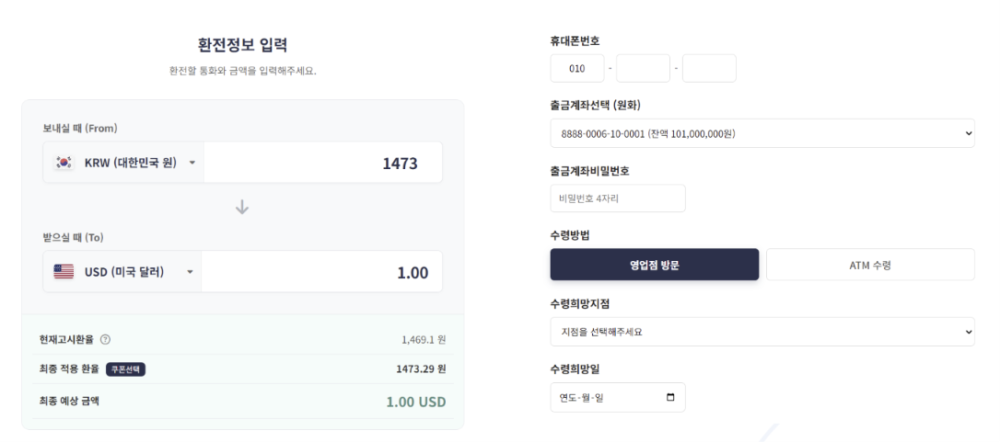
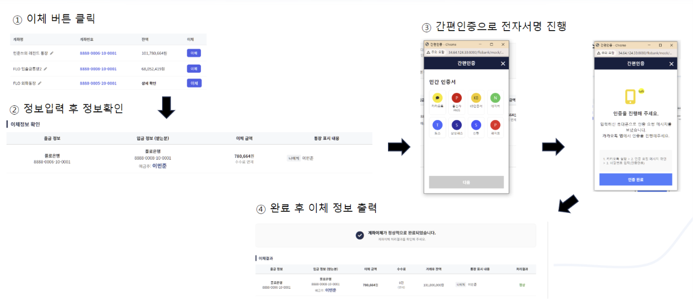
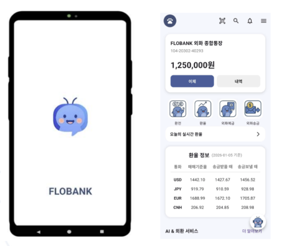
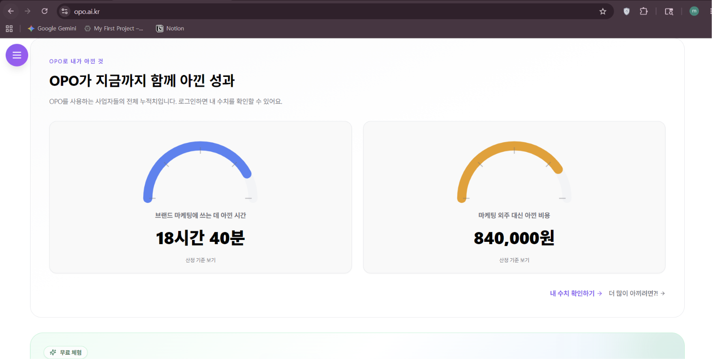
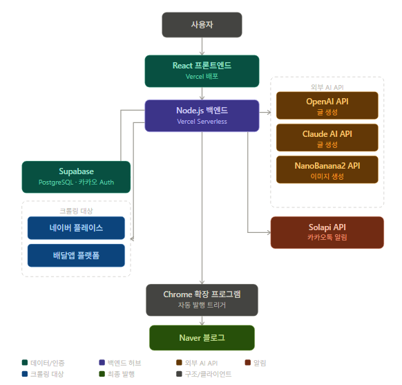
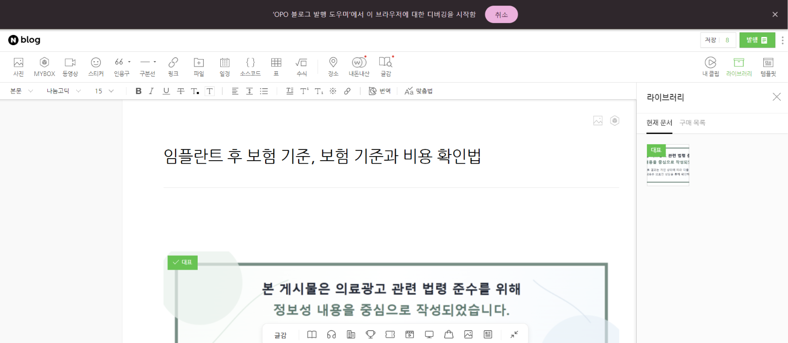

<div align="center">

# 이민준
### Backend Developer

금융 서비스의 안정성과 데이터 정합성을 고민하는 백엔드 개발자입니다.

Java와 Spring Boot를 중심으로 금융 서비스를 개발하고,  
실제 DB 장애를 계기로 장애 감지부터 요청 전환, 데이터 복제, 장애 격리까지 설계·검증했습니다.

<br/>

<a href="https://github.com/Lee-MJ01">
  
</a>
<a href="mailto:alswnstl23@gmail.com">
  
</a>

</div>

---

## About Me

<table>
<tr>
<td width="50%" valign="top">

### Backend
- Java / Spring Boot 기반 서버 개발
- REST API 및 인증·인가
- 금융 트랜잭션 처리
- Oracle / PostgreSQL / Redis

</td>
<td width="50%" valign="top">

### Reliability
- Master / Slave DB 구조
- 장애 감지 및 Failover
- 동적 DataSource Routing
- 장애 격리 및 복제 전략 설계

</td>
</tr>

<tr>
<td width="50%" valign="top">

### DevOps
- Docker / Nginx
- GitHub Actions
- GCP
- Vercel

</td>
<td width="50%" valign="top">

### Experience
- 금융 프로젝트 팀 리더
- 1인 SaaS 개발·배포·운영
- BNK 금융 DT 아카데미
- SSAFY 16기

</td>
</tr>
</table>

---

## Tech Stack

### Backend

<p>


</p>

### Database

<p>


</p>

### DevOps

<p>


</p>

### Frontend / Service

<p>


</p>

---

# Projects

## FLOBANK
### 금융 이체·환전 웹 / 앱 플랫폼

> **DB 장애를 계기로 고가용성 구조를 설계하고 실제 장애 상황까지 검증한 금융 프로젝트**

<p align="center">
  
</p>

<table>
<tr>
<td><b>Team</b></td>
<td>6인 프로젝트 / 팀장</td>
</tr>
<tr>
<td><b>Role</b></td>
<td>Backend / Infrastructure</td>
</tr>
<tr>
<td><b>Tech</b></td>
<td>Java, Spring Boot, Oracle, Redis, Docker, Nginx, GCP, GitHub Actions</td>
</tr>
<tr>
<td><b>Result</b></td>
<td>프로젝트 최우수상</td>
</tr>
</table>

### Architecture

<p align="center">
  
</p>

### Key Features

<p align="center">
  
  
</p>

- 이체·환전 및 금융 트랜잭션 기능 구현
- 사용자 인증·인가 기능 구현
- Oracle Master / Slave DB 구조 구성
- GitHub Actions 기반 CI/CD 파이프라인 구축
- Docker / Nginx 기반 배포 환경 구성

### Failure Handling

```text
DB 장애 발생
    ↓
Ping 전용 DataSource로 상태 확인 분리
    ↓
AbstractRoutingDataSource 기반 요청 전환
    ↓
데이터 중요도에 따라 복제 전략 분리
    ↓
핵심 데이터 → 동기 복제
비핵심 데이터 → Redis Queue
    ↓
Master / Slave TransactionManager 분리
    ↓
Slave 장애 격리
    ↓
docker stop 기반 장애 주입 테스트
```

단순히 이중화 구조를 구성하는 데 그치지 않고,
장애 감지 → 요청 전환 → 데이터 복제 → 장애 격리 → 장애 주입 검증까지 직접 진행했습니다.

<p align="center">  </p> <p> <a href="https://github.com/Lee-MJ01/busan-bank-project1">  </a> <a href="https://github.com/Lee-MJ01/BNK_Project2_1team">  </a> </p>
Opo
1인 SaaS 서비스

아이디어 단계부터 설계·개발·배포·운영까지 직접 수행한 개인 프로젝트

<p align="center">  </p> <table> <tr> <td><b>Role</b></td> <td>1인 개발</td> </tr> <tr> <td><b>Tech</b></td> <td>Next.js, React, TypeScript, Supabase, PostgreSQL, Vercel</td> </tr> <tr> <td><b>Scope</b></td> <td>기획 → 설계 → 개발 → 배포 → 운영</td> </tr> </table>
Architecture
<p align="center">  </p>
Service Flow
<p align="center">  </p>
서비스 아이디어 및 기능 구조 설계
데이터 구조 설계
AI 기반 콘텐츠 생성
네이버 블로그 자동 발행
인증 및 데이터베이스 연동
Vercel + Supabase 기반 배포
실제 서비스 운영 경험
<p> <a href="https://opo.ai.kr">  </a> </p>
Smart Plant
IoT 기반 자율 이동 식물 관리 시스템

센서 데이터를 수집하는 데서 끝나지 않고, 햇빛 방향을 탐색해 스스로 이동하는 화분을 구현한 학부 캡스톤 프로젝트

4인 팀 프로젝트 / 팀장
Python / Flask / Arduino
센서 데이터 수집
Flask 기반 제어 서버 구현
APScheduler 기반 주기 작업 자동화
Serial Communication 기반 하드웨어 제어
조도 데이터를 기반으로 이동 방향 판단
Experience & Education
<table> <tr> <td width="30%"><b>SSAFY 16기</b></td> <td>Java 기반 알고리즘 및 자료구조 학습, 문제 해결 역량 강화</td> </tr> <tr> <td><b>BNK 부산은행 금융 DT 아카데미</b></td> <td>약 1,000시간 실무형 교육 / Java, Spring, DB, Flutter, 생성형 AI</td> </tr> <tr> <td><b>동의대학교</b></td> <td>컴퓨터공학과 졸업</td> </tr> <tr> <td><b>항공 부품 관련 실무</b></td> <td>Excel 기반 재고 및 납기 관리</td> </tr> <tr> <td><b>컴퓨터공학과 학생회장</b></td> <td>1년간 조직 운영 및 협업 경험</td> </tr> </table>
Certifications
<p>   </p>
Developer Mindset

동작하는 것과 무너지지 않는 것은 다르다고 생각합니다.

기능이 정상적으로 동작하는 순간뿐 아니라,
예상하지 못한 값이나 장애가 발생했을 때 시스템이 어떻게 반응하는지도 함께 고민합니다.

문제가 해결되더라도 원인을 설명할 수 있어야 끝났다고 생각합니다.

문제를 임시로 우회하기보다,
왜 문제가 발생했고 왜 이 방식으로 해결되는지를 이해하려고 합니다.

그 과정에서 얻은 이해를 다음 문제에서도 활용할 수 있는 개발자가 되고자 합니다.

<div align="center">
Contact
<a href="https://github.com/Lee-MJ01">  </a> <a href="mailto:alswnstl23@gmail.com">  </a> </div> ```
